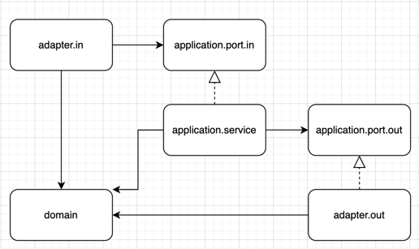

# 아키텍처

## 아키텍처 개요
- RoomUnion은 모놀리스 아키텍처로 헥사고날 아키텍처를 채택하고 있다.
- RoomUnion은 모놀리스 프로젝트로 의존성 흐름을 강제할 수 없다. 이에 규칙을 정하고자 한다.
- RoomUnion은 크게 3개의 레이어로 구성된다.
  - adapter
    - 외부 시스템과의 통신을 담당한다.
    - ex) REST API, DB, Redis, 메시징 시스템 등
  - application
    - 비즈니스 로직의 흐름을 담당한다.
  - domain
    - 비즈니스 도메인의 상태와 행위, 핵심 비즈니스 로직을 담당한다.

## 의존성 흐름

